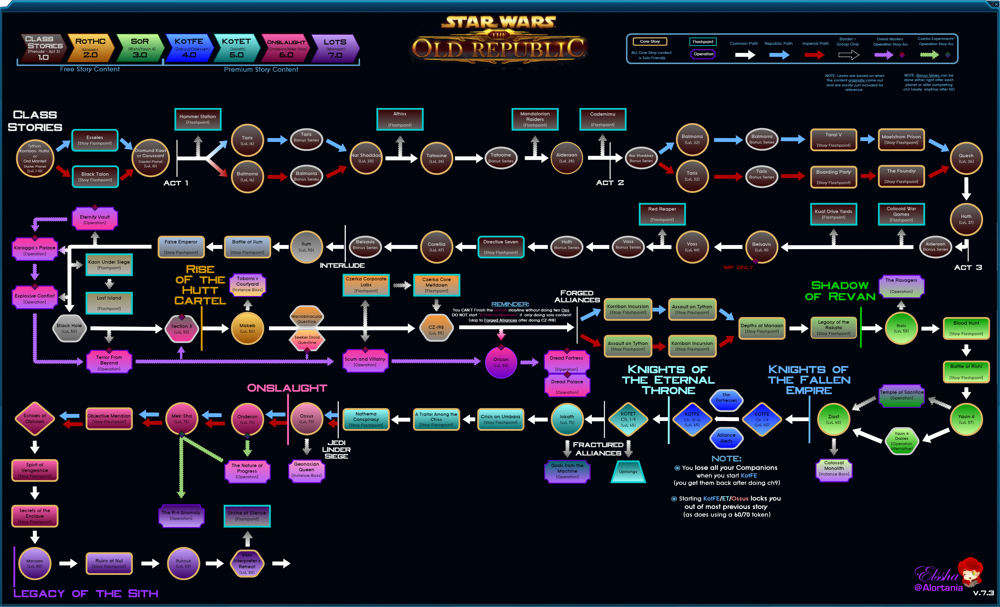

FlowChart 7.3

## Jedi Knight

Gallery

<ul>
<li><a href="https://bikuluki.github.io/swtor.knight.0.prologue.1.tython">swtor.knight.0.prologue.1.tython</a></li>
<li><a href="https://bikuluki.github.io/swtor.knight.0.prologue.2.fleet">swtor.knight.0.prologue.2.fleet</a></li>
<li><a href="https://bikuluki.github.io/swtor.knight.0.prologue.3.coruscant">swtor.knight.0.prologue.3.coruscant</a></li>
<li><a href="https://bikuluki.github.io/swtor.knight.1.1.ord.mantell">swtor.knight.1.1.ord.mantell</a></li>
<li><a href="https://bikuluki.github.io/swtor.knight.1.2.taris">swtor.knight.1.2.taris</a></li>
<li><a href="https://bikuluki.github.io/swtor.knight.1.3.nar.shaddaa">swtor.knight.1.3.nar.shaddaa</a></li>
<li><a href="https://bikuluki.github.io/swtor.knight.1.4.abandonded.mining.facility.and.tython">swtor.knight.1.4.abandonded.mining.facility.and.tython</a></li>
<li><a href="https://bikuluki.github.io/swtor.knight.1.5.alderaan">swtor.knight.1.5.alderaan</a></li>
<li><a href="https://bikuluki.github.io/swtor.knight.1.6.tatooine">swtor.knight.1.6.tatooine</a></li>
<li><a href="https://bikuluki.github.io/swtor.knight.1.7.uphrades">swtor.knight.1.7.uphrades</a></li>
<li><a href="https://bikuluki.github.io/swtor.knight.1.8.opressor.and.tython">swtor.knight.1.8.opressor.and.tython</a></li>
<li><a href="https://bikuluki.github.io/swtor.knight.2.1.balmorra">swtor.knight.2.1.balmorra</a></li>
<li><a href="https://bikuluki.github.io/swtor.knight.2.2.quesh">swtor.knight.2.2.quesh</a></li>
<li><a href="https://bikuluki.github.io/swtor.knight.2.3.hoth">swtor.knight.2.3.hoth</a></li>
<li><a href="https://bikuluki.github.io/swtor.knight.2.4.fp.jedi.prisoner.taral.v.maelstrom.prison">swtor.knight.2.4.fp.jedi.prisoner.taral.v.maelstrom.prison</a></li>
<li><a href="https://bikuluki.github.io/swtor.knight.2.5.emperor.fortress">swtor.knight.2.5.emperor.fortress</a></li>
<li><a href="https://bikuluki.github.io/swtor.knight.3.1.belsavis">swtor.knight.3.1.belsavis</a></li>
<li><a href="https://bikuluki.github.io/swtor.knight.3.2.korriban.flame">swtor.knight.3.2.korriban.flame</a></li>
<li><a href="https://bikuluki.github.io/swtor.knight.3.3.voss">swtor.knight.3.3.voss</a></li>
<li><a href="https://bikuluki.github.io/swtor.knight.3.4.corellia">swtor.knight.3.4.corellia</a></li>
<li><a href="https://bikuluki.github.io/swtor.knight.3.5.dromund.kaas">swtor.knight.3.5.dromund.kaas</a></li>
</ul>

## Sith Warrior 

Gallery
<ul>
<li><a href="https://bikuluki.github.io/swtor.warrior.0.1.korriban">swtor.warrior.0.1.korriban</a></li>
<li><a href="https://bikuluki.github.io/swtor.warrior.0.2.black.talon">swtor.warrior.0.2.black.talon</a></li>
<li><a href="https://bikuluki.github.io/swtor.warrior.0.3.dromund.kaas.n.vette.n.hk">swtor.warrior.0.3.dromund.kaas.n.vette.n.hk</a></li>
<li><a href="https://bikuluki.github.io/swtor.warrior.1.1.balmorra">swtor.warrior.1.1.balmorra</a></li>
<li><a href="https://bikuluki.github.io/swtor.warrior.1.2.nar.shaddaa">swtor.warrior.1.2.nar.shaddaa</a></li>
<li><a href="https://bikuluki.github.io/swtor.warrior.1.3.orbital.station">swtor.warrior.1.3.orbital.station</a></li>
<li><a href="https://bikuluki.github.io/swtor.warrior.1.4.alderaan">swtor.warrior.1.4.alderaan</a></li>
<li><a href="https://bikuluki.github.io/swtor.warrior.1.5.tatooine">swtor.warrior.1.5.tatooine</a></li>
<li><a href="https://bikuluki.github.io/swtor.warrior.1.6.jaessa.ship">swtor.warrior.1.6.jaessa.ship</a></li>
<li><a href="https://bikuluki.github.io/swtor.warrior.1.7.hutta">swtor.warrior.1.7.hutta</a></li>
<li><a href="https://bikuluki.github.io/swtor.warrior.2.0.plan.zero">swtor.warrior.2.0.plan.zero</a></li>
<li><a href="https://bikuluki.github.io/swtor.warrior.2.1.taris">swtor.warrior.2.1.taris</a></li>
<li><a href="https://bikuluki.github.io/swtor.warrior.2.2.darth.vengean.flagship">swtor.warrior.2.2.darth.vengean.flagship</a></li>
<li><a href="https://bikuluki.github.io/swtor.warrior.2.3.hoth">swtor.warrior.2.3.hoth</a></li>
<li><a href="https://bikuluki.github.io/swtor.warrior.2.4.dromund.kaas">swtor.warrior.2.4.dromund.kaas</a></li>
<li><a href="https://bikuluki.github.io/swtor.warrior.3.1.quesh">swtor.warrior.3.1.quesh</a></li>
<li><a href="https://bikuluki.github.io/swtor.warrior.3.2.belsavis">swtor.warrior.3.2.belsavis</a></li>
<li><a href="https://bikuluki.github.io/swtor.warrior.3.3.hoth">swtor.warrior.3.3.hoth</a></li>
<li><a href="https://bikuluki.github.io/swtor.warrior.3.4.voss">swtor.warrior.3.4.voss</a></li>
<li><a href="https://bikuluki.github.io/swtor.warrior.3.5.corellia">swtor.warrior.3.5.corellia</a></li>
<li><a href="https://bikuluki.github.io/swtor.warrior.3.6.korriban">swtor.warrior.3.6.korriban</a></li>
</ul>

## Post-Kotet

Gallery
<ul>
<li><a href="https://bikuluki.github.io/swtor.post.kotet">swtor.post.kotet</a></li>
</ul>

