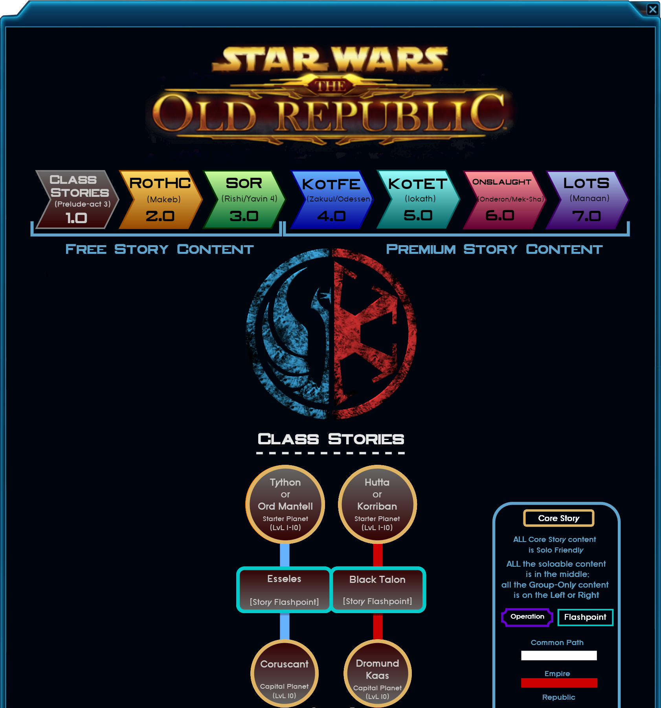
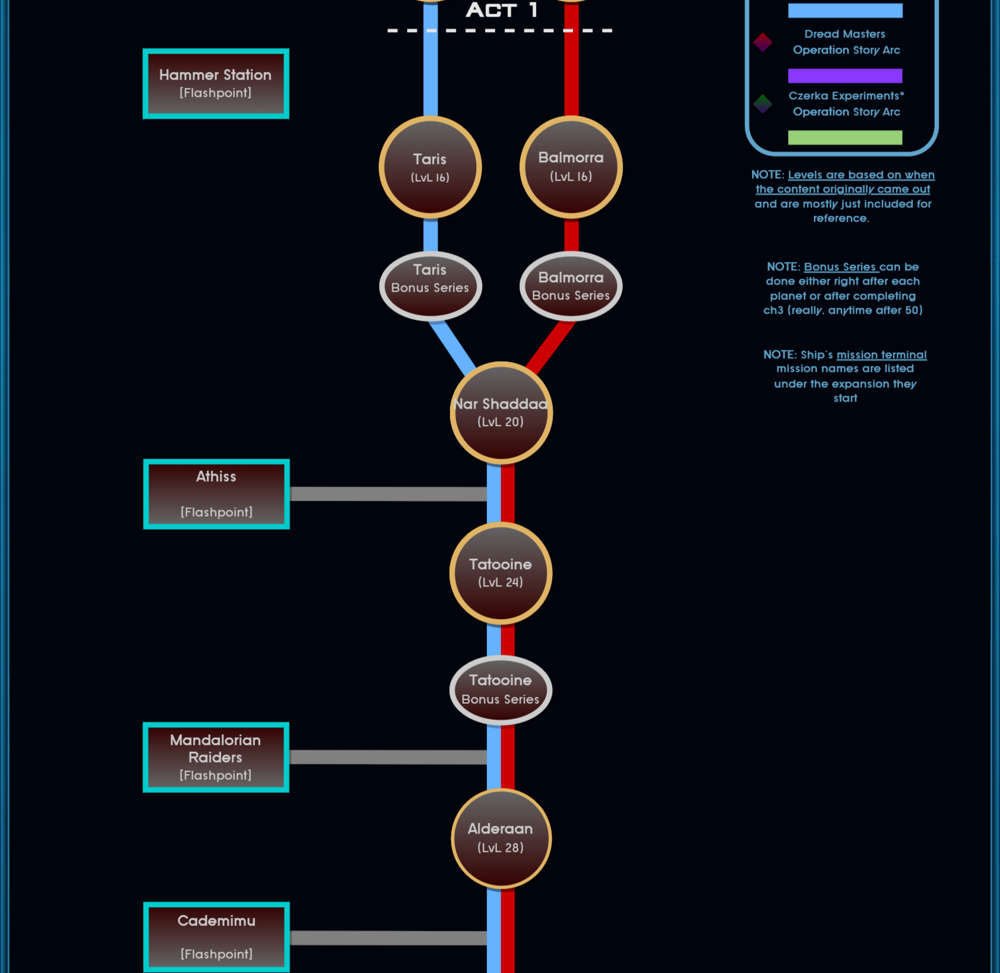
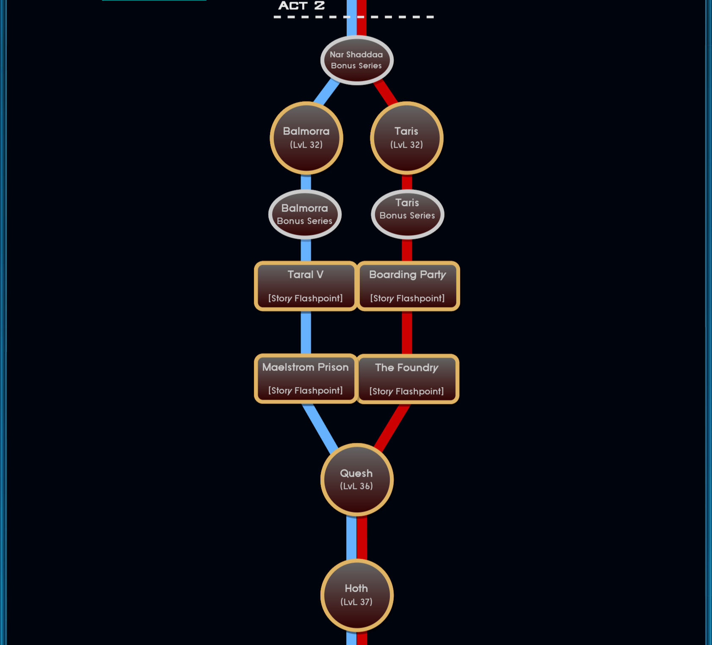
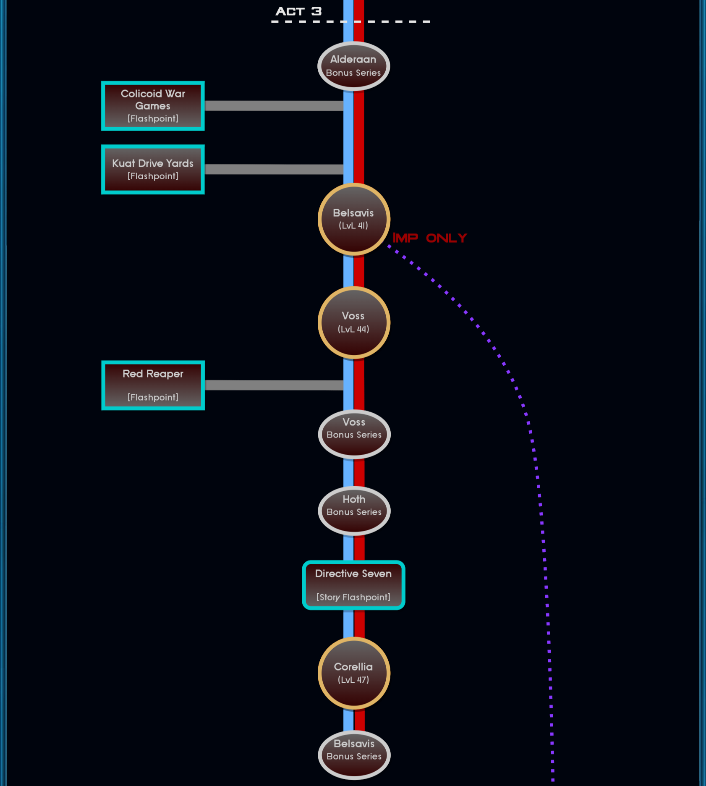
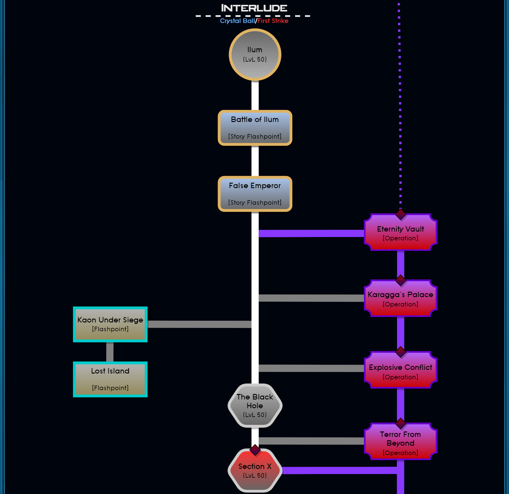
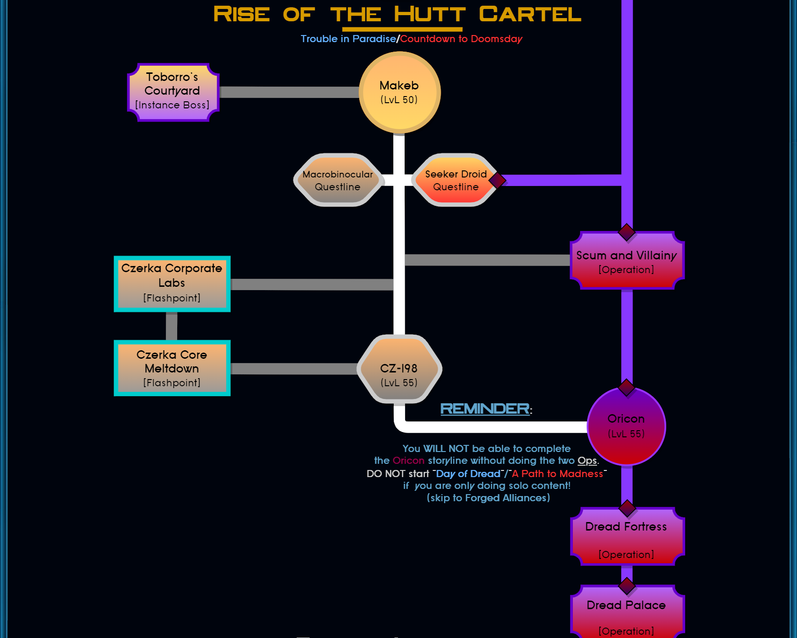
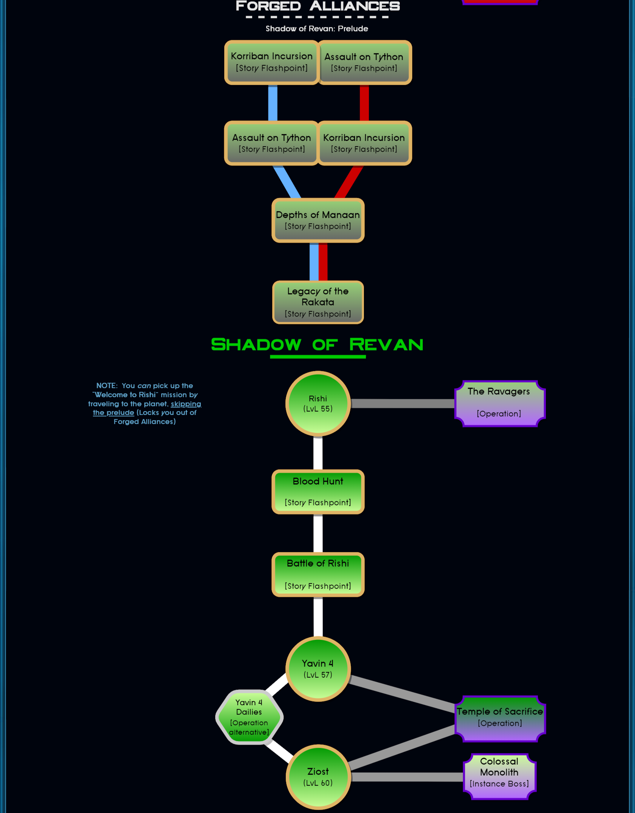
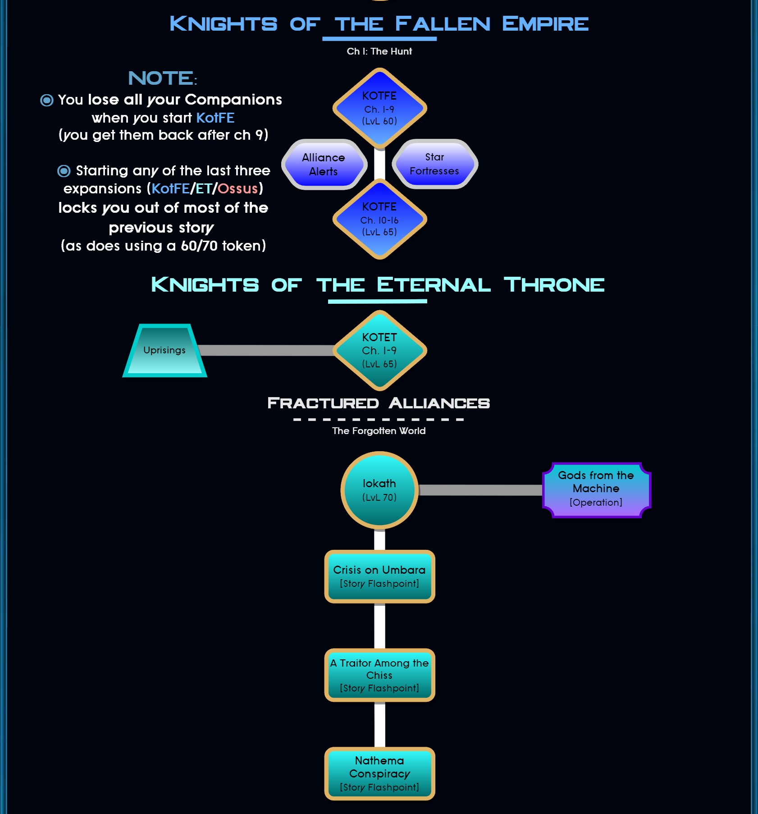
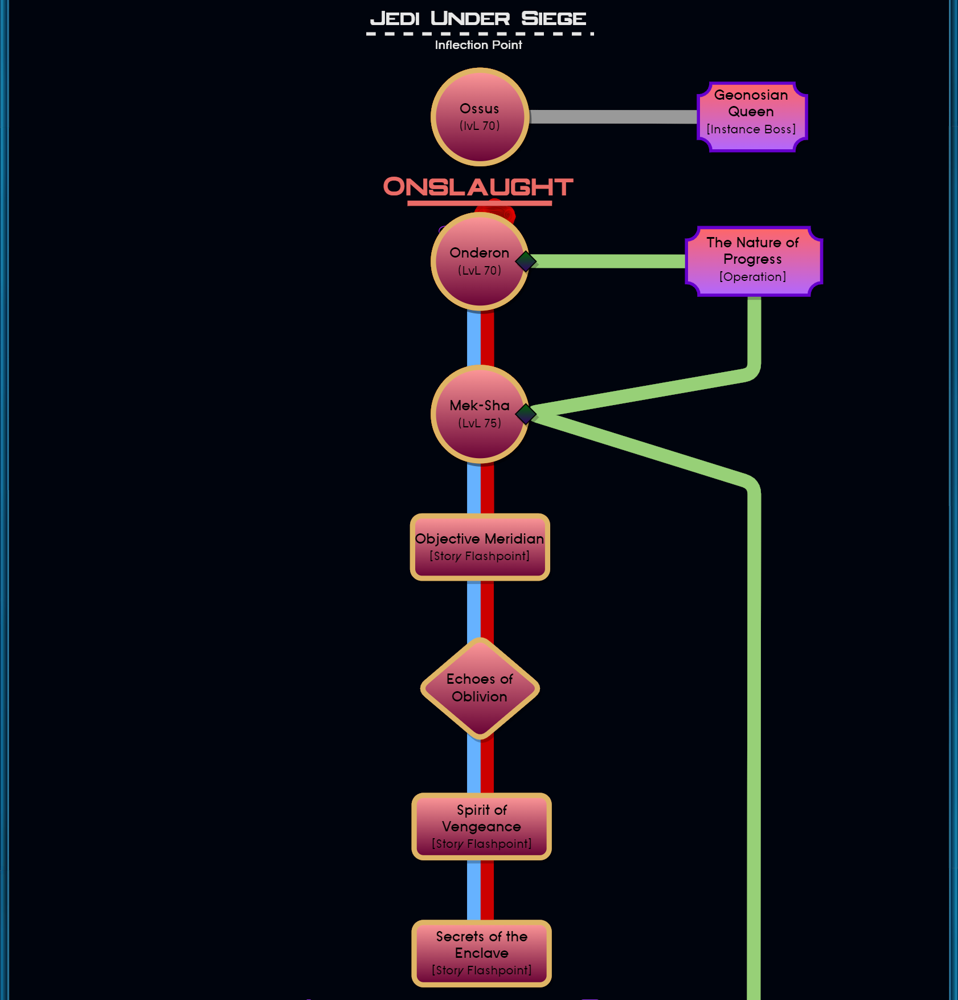
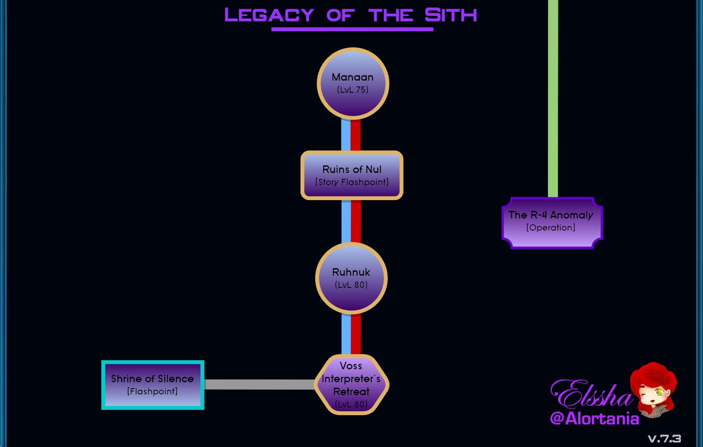

[GG16 The Old Republic Guide](GG16_The_Old_Republic.pdf)

## Flow Chart

Prelude

Act 1

Act 2

Act 3

Interlude

Rise of the Hutt Cartel

Shadow of Revan

KotFE/T

Jedi Under Siege

Legacy of the Sith

## Republic Class Stories

Jedi Knight

<ul>
<li><a href="/swtor.knight.1.0.1.tython">swtor.knight.1.0.1.tython</a></li>
<li><a href="/swtor.knight.1.0.2.fleet">swtor.knight.1.0.2.fleet</a></li>
<li><a href="/swtor.knight.1.0.3.coruscant">swtor.knight.1.0.3.coruscant</a></li>
<li><a href="/swtor.knight.1.1.1.ord.mantell">swtor.knight.1.1.1.ord.mantell</a></li>
<li><a href="/swtor.knight.1.1.2.taris">swtor.knight.1.1.2.taris</a></li>
<li><a href="/swtor.knight.1.1.3.nar.shaddaa">swtor.knight.1.1.3.nar.shaddaa</a></li>
<li><a href="/swtor.knight.1.1.4.abandonded.mining.facility.and.tython">swtor.knight.1.1.4.abandonded.mining.facility.and.tython</a></li>
<li><a href="/swtor.knight.1.1.5.alderaan">swtor.knight.1.1.5.alderaan</a></li>
<li><a href="/swtor.knight.1.1.6.tatooine">swtor.knight.1.1.6.tatooine</a></li>
<li><a href="/swtor.knight.1.1.7.uphrades">swtor.knight.1.1.7.uphrades</a></li>
<li><a href="/swtor.knight.1.1.8.opressor.and.tython">swtor.knight.1.1.8.opressor.and.tython</a></li>
<li><a href="/swtor.knight.1.2.1.balmorra">swtor.knight.1.2.1.balmorra</a></li>
<li><a href="/swtor.knight.1.2.2.quesh">swtor.knight.1.2.2.quesh</a></li>
<li><a href="/swtor.knight.1.2.3.hoth">swtor.knight.1.2.3.hoth</a></li>
<li><a href="/swtor.knight.1.2.4.fp.jedi.prisoner.taral.v.maelstrom.prison">swtor.knight.1.2.4.fp.jedi.prisoner.taral.v.maelstrom.prison</a></li>
<li><a href="/swtor.knight.1.2.5.emperor.fortress">swtor.knight.1.2.5.emperor.fortress</a></li>
<li><a href="/swtor.knight.1.3.1.belsavis">swtor.knight.1.3.1.belsavis</a></li>
<li><a href="/swtor.knight.1.3.2.korriban.flame">swtor.knight.1.3.2.korriban.flame</a></li>
<li><a href="/swtor.knight.1.3.3.voss">swtor.knight.1.3.3.voss</a></li>
<li><a href="/swtor.knight.1.3.4.corellia">swtor.knight.1.3.4.corellia</a></li>
<li><a href="/swtor.knight.1.3.5.dromund.kaas">swtor.knight.1.3.5.dromund.kaas</a></li>
</ul>

Jedi Consular

<h3>Prologue</h3>

In a time of great turmoil across the galaxy, a gifted Padawan travels to the Jedi’s ancient homeworld of Tython to complete the final trials and become a fully fledged Jedi. Under the tutelage of Master Yuon Par, an unorthodox but experienced teacher and historian, a sinister plot is uncovered that could bring about the destruction of the Jedi Order.

Embodying the true skill and dedication, the Padawan confronts the spirit of an ancient Jedi known as Rajivari, and defeats a vengeful young man who had pledged himself to learning Rajivari’s secrets. Impressed by these exceptional achievements, the Jedi Council promotes Yuon’s Padawan to full membership in the Order as its newest Consular. However, this powerful Jedi’s adventures are only just beginning…

<h3>Chapter One: The Plague of Lord Vivicar</h3>

As the Consular ascends to the rank of full Jedi, several of the galaxy’s most talented Jedi Masters are suddenly stricken with a mysterious illness. This plague cripples its victims with paranoia and madness, driving them towards the dark side of the Force. Master Yuon Par is one of the first to suffer the strange plague’s effects, leaving her determined former student to seek out an ancient shielding technique, which may be Yuon’s only hope. The technique is a success and Yuon is saved from the plague’s worst effects. The Consular – now the only Jedi in the galaxy who knows the secrets of this shielding technique – sets out on a dangerous adventure to seek out others afflicted by the plague and determine its cause.

After a long and difficult search, the Consular discovers that the plague was created long ago, by an ancient Sith who possesses terrifying power. The identity of the man responsible for the plague’s reemergence is also revealed: a Sith Lord known as Vivicar. A corrupted former Jedi, Vivicar sought revenge against the Jedi who had left him for dead during a mission to the corrupted world of Malachor III. Vivicar unleashed the plague upon these Jedi, which forced them to relive that fateful mission.

Boarding Vivicar’s flagship, the Consular challenges and defeats Vivicar, only to discover that Vivicar is possessed by the spirit of the plague’s original creator, the ancient Sith Lord Terrak Morrhage. The Consular faces a near-impossible choice: risk attempting to redeem Vivicar and restore every Jedi afflicted with his plague, or cut Vivicar down, which would kill every plague-stricken Jedi, but would also destroy the plague and its evil, forever.

<h3>Chapter Two: The Rift Alliance</h3>

Having demonstrated exceptional wisdom and skill, the Consular is granted the rank of Master just in time for a new and challenging assignment. With many Republic member-worlds losing faith that the Empire can be defeated, ad group of indispensable planets, including Balmorra, Saleucami, Manaan, Aeten II, and Erigorm, have bonded together to form the Rift Alliance, a group of worlds nearing outright rebellion. The newly promoted Jedi Consular is charged by the Supreme Chancellor himself with the task of aiding these worlds and re-forging their shattered trust in the Republic.

Traveling across the galaxy, the Consular works with Rift Alliance representatives to protect their worlds and win their trust. But a sudden betrayal by a member of the Alliance reveals that the Republic and the Jedi Order have both been infiltrated by an unknown number of spies known as the Children of the Emperor. Manipulated by the Emperor’s power, these spies are ignorant of the evil lurking inside them. Not even the Jedi can sense their corruption. But with a full-scale war erupting across the galaxy, the Children are about to “awaken” and strike where the Republic is most vulnerable.

### Chapter Three: Children of the Emperor

Faced with undetectable infiltrators and a full-scale Imperial onslaught, the Consular and the Rift Alliance work together to recruit new Republic allies. The Consular rallies an army of powerful allies on the distant worlds of Voss and Belsavis and leads their charge to the embattled world of Corellia. There, the Children of the Emperor have fully awakened and spread chaos in the Republic ranks. Perhaps worst of all, the Childrens’ leader, the “First Son” is revealed to be a trusted and longtime member of the Jedi Council.

Acting on the Consular’s advice, the armies of the Rift Alliance gradually push back the Empire’s forces on Corellia to uncover the First Son’s hiding place. The determined Consular launches a last-ditch assault against the First Son’s lair. In a climactic final battle with the galaxy at stake, these two masters of the Force cross sabers. The Consular ultimately defeats the First Son and emerges victorious. Without the First Son’s protection, the Children of the Emperor are revealed to the Jedi, allowing the Republic to steel itself against the Empire. Meanwhile the Consular is saluted as a hero of the order, ready for whatever challenges lie ahead.

<ul>
<li><a href="/swtor.consular.companions">swtor.consular.companions</a></li>
<li><a href="/swtor.consular.0.1.tython">swtor.consular.0.1.tython</a></li>
<li><a href="/swtor.consular.1.1.coruscant">swtor.consular.1.1.coruscant</a></li>
<li><a href="/swtor.consular.1.2.taris">swtor.consular.1.2.taris</a></li>
<li><a href="/swtor.consular.1.3.nar.shaddaa">swtor.consular.1.3.nar.shaddaa & Carida</a></li>
<li><a href="/swtor.consular.1.4.tatooine">swtor.consular.1.4.tatooine</a></li>
<li><a href="/swtor.consular.1.5.alderaan">swtor.consular.1.5.alderaan</a></li>
<li><a href="/swtor.consular.2.1.balmorra">swtor.consular.2.1.balmorra</a></li>
<li><a href="/swtor.consular.2.2.quesh">swtor.consular.2.2.quesh</a></li>
<li><a href="/swtor.consular.2.3.hoth">swtor.consular.2.3.hoth</a></li>
<li><a href="/swtor.consular.3.1.belsavis">swtor.consular.3.1.belsavis</a></li>
<li><a href="/swtor.consular.3.2.voss">swtor.consular.3.2.voss & Javelin</a></li>
<li><a href="/swtor.consular.3.3.corellia">swtor.consular.3.3.corellia</a></li>
</ul>

## Empire Class Stories

Sith Warrior
<ul>
<li><a href="/swtor.warrior.0.1.korriban">swtor.warrior.0.1.korriban</a></li>
<li><a href="/swtor.warrior.0.2.black.talon">swtor.warrior.0.2.black.talon</a></li>
<li><a href="/swtor.warrior.0.3.dromund.kaas.n.vette.n.hk">swtor.warrior.0.3.dromund.kaas.n.vette.n.hk</a></li>
<li><a href="/swtor.warrior.1.1.balmorra">swtor.warrior.1.1.balmorra</a></li>
<li><a href="/swtor.warrior.1.2.nar.shaddaa">swtor.warrior.1.2.nar.shaddaa</a></li>
<li><a href="/swtor.warrior.1.3.orbital.station">swtor.warrior.1.3.orbital.station</a></li>
<li><a href="/swtor.warrior.1.4.alderaan">swtor.warrior.1.4.alderaan</a></li>
<li><a href="/swtor.warrior.1.5.tatooine">swtor.warrior.1.5.tatooine</a></li>
<li><a href="/swtor.warrior.1.6.jaessa.ship">swtor.warrior.1.6.jaessa.ship</a></li>
<li><a href="/swtor.warrior.1.7.hutta">swtor.warrior.1.7.hutta</a></li>
<li><a href="/swtor.warrior.2.0.plan.zero">swtor.warrior.2.0.plan.zero</a></li>
<li><a href="/swtor.warrior.2.1.taris">swtor.warrior.2.1.taris</a></li>
<li><a href="/swtor.warrior.2.2.darth.vengean.flagship">swtor.warrior.2.2.darth.vengean.flagship</a></li>
<li><a href="/swtor.warrior.2.3.hoth">swtor.warrior.2.3.hoth</a></li>
<li><a href="/swtor.warrior.2.4.dromund.kaas">swtor.warrior.2.4.dromund.kaas</a></li>
<li><a href="/swtor.warrior.3.1.quesh">swtor.warrior.3.1.quesh</a></li>
<li><a href="/swtor.warrior.3.2.belsavis">swtor.warrior.3.2.belsavis</a></li>
<li><a href="/swtor.warrior.3.3.hoth">swtor.warrior.3.3.hoth</a></li>
<li><a href="/swtor.warrior.3.4.voss">swtor.warrior.3.4.voss</a></li>
<li><a href="/swtor.warrior.3.5.corellia">swtor.warrior.3.5.corellia</a></li>
<li><a href="/swtor.warrior.3.6.korriban">swtor.warrior.3.6.korriban</a></li>
</ul>

## Planet Arcs

Gallery
<ul>
<li><a href="/swtor.planet.01.coruscant">swtor.planet.01.coruscant</a></li>
</ul>

## Post-Kotet

Gallery
<ul>
<li><a href="/swtor.post.kotet">swtor.post.kotet</a></li>
</ul>

##

  
<a href="{{ site.github.repository_url }}">View the Project on GitHub <small>{{ site.github.repository_nwo }}</small></a>


